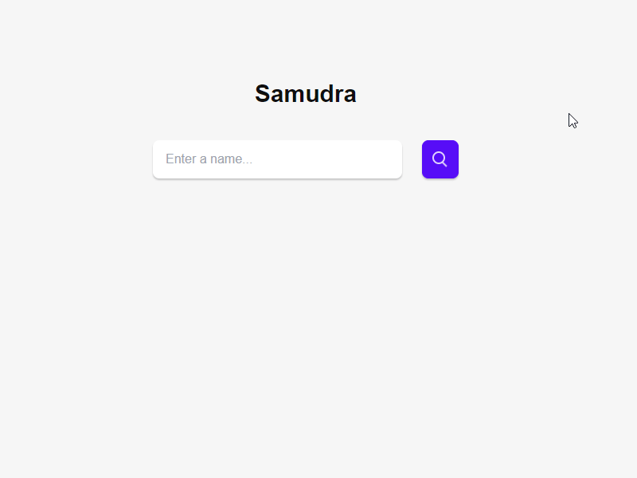

# Samudra App

Pembangunan antaramuka Samudra menggunakan [Tauri](https://tauri.app/) dan [Svelte](https://svelte.dev/)



## Fitur
Buat masa ini, hanya mampu queri data lemma dan dipulangkan lemma + konsep sahaja.

## Pembangunan
1. Klon repo ini.
2. Gunakan cargo atau npm untuk laksanakan skrip pembangunan
    ```
    cargo tauri dev
    ```
    atau
    ```
    npm tauri dev
    ```
3. Buat database sendiri dan laksanakan skrip `migration` guna [sqlx-cli](https://github.com/launchbadge/sqlx/blob/main/sqlx-cli/README.md). Aplikasi ini masih belum ada ciri menghasilkan database sendiri jadi buat masa sekarang kena guna cara ni.
    ```
    sqlx database create --database-url <TEMPAT DB SQLITE>
    cd src-tauri
    sqlx migrate run --database-url <TEMPAT DB SQLITE>
    ```